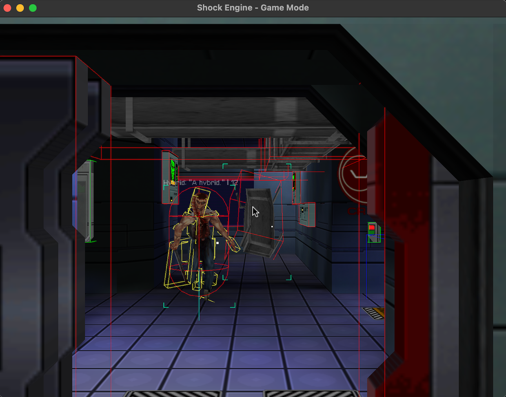
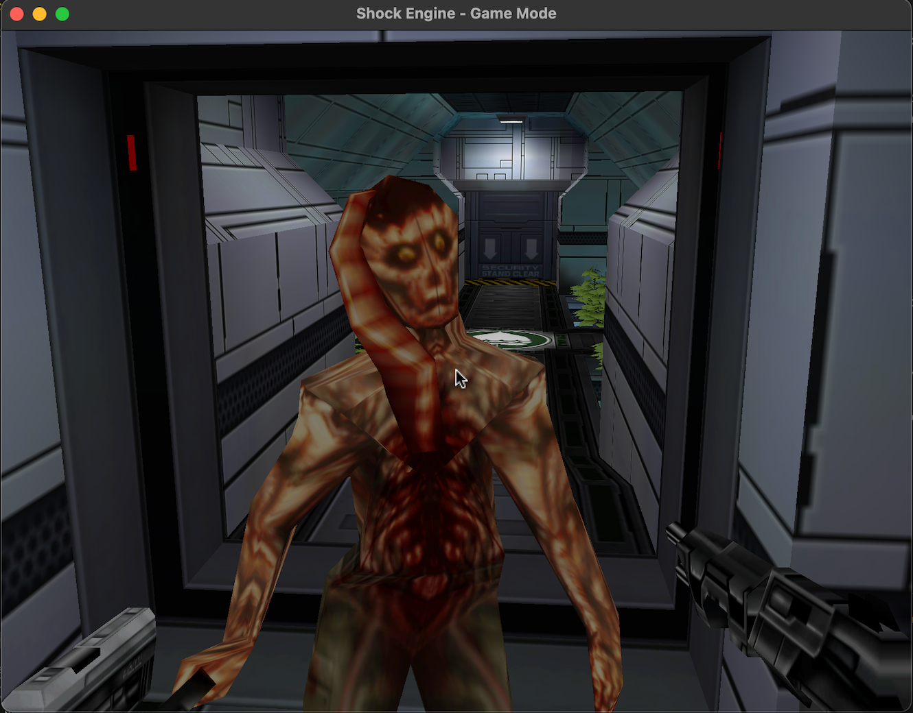
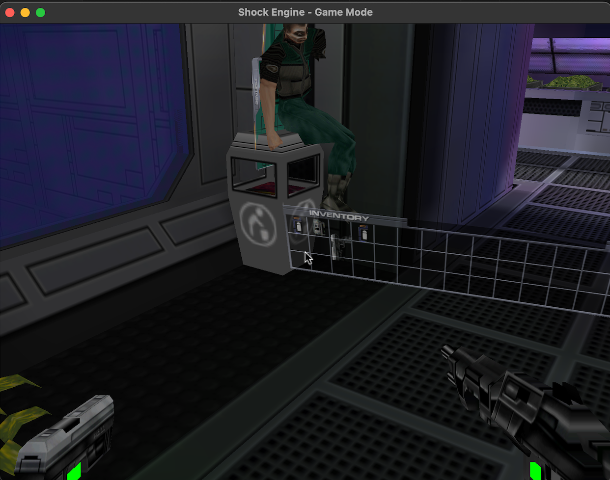

# shock2quest

 

A project to experience the of System Shock 2 in virtual reality. System Shock 2 is one of my favorite games of all time, and the story and ambience would be a great for VR. 

This project is a [game engine recreation](https://en.wikipedia.org/wiki/Game_engine_recreation) of the [Dark engine](https://en.wikipedia.org/wiki/Dark_Engine) - geared towards VR experiences.

You'll need a full retail copy of System Shock 2 in order to play - recommend purchasing at either [GoG](https://www.gog.com/game/system_shock_2) or [Steam](https://store.steampowered.com/app/238210/System_Shock_2/). 

>NOTE: This is currently in a a _pre-alpha_ state and not really playable in any meaningful way, yet. I also have to apologize for the quality of the code, this is my first Rust project - so certainly a lot of room for improvement (and a lot of hacks and experiments!) It's a project done in bits of spare time, but wanted to share out in case it is fun or useful for anyone.

## Screenshots

- Hitboxes

- Dual Wielding + Character Models

- Floating Inventory for VR

## Running

> TODO: Provide binaries

### Controls

This is geared towards VR, so the control scheme is really meant for VR headsets and controllers.

However, you can play with a keyboard and a mouse, using the following hard-coded keys:
- `Mouse` - look around with headset, when `Q` and `E` are not pressed
- `W` `A` `S` `D` - move around
- `Q` `E` - control left hand or right hand, respectively. Mouse look will move the hand, left click will 'trigger', and right click will 'grab'.

## Building 

See [DEVELOPMENT.md](DEVELOPMENT.MD)

## Roadmap

 Pre Alpha: Initial development 
- [x] Load gamesys 
- [x] Speech DB / env sounds 
- [ ] Menu / Launcher
- [ ] Character sounds
- [ ] Basic AI 
- [ ] Load/save 
- [ ] Basic item usage 
- [ ] Initial inventory management 
- [ ] Psi Powers
- [ ] Act/React implementation 
- [ ] Cutscenes
- [ ] Lighting implementation (Doom 3 multi-pass shadow rendering)
- [ ] Mod support

## License

Some code is ported from [openDarkEngine](https://github.com/volca02/openDarkEngine), so this code is licensed under [GPLv2](https://www.gnu.org/licenses/old-licenses/gpl-2.0.en.html) to comply with that license.

In addition, code in the `engine` folder is agnostic of Shock2, so is dual-licensed under the MIT license.

# Thanks

There were several projects around the SS2 community, that served as an inspiration, or were used to help understand the internals of the dark engine and file formats, notably:

- [openDarkEngine](https://github.com/volca02/openDarkEngine) by [volca02](https://github.com/volca02)
- [SystemShock2VR](https://github.com/Kernvirus/SystemShock2VR) by [Kernvirus](https://github.com/Kernvirus)

Outside of the system shock/thief community, the work that [Team Beef](https://sidequestvr.com/community/7/team-beef-game-ports) has done in bringing games to VR inspired this project. 

In addition, there were several great Rust libraries that helped bring this project to life:
- [`rapier`](https://github.com/dimforge/rapier) - Physics Library
- [`openxr`](https://github.com/Ralith/openxrs) - Bindings for OpenXR
- [`rodio`](https://github.com/RustAudio/rodio) - Audio Support
- [`serde`](https://serde.rs/) - Serialization / Deserialization (Load/Save)
- [`cgmath`](https://github.com/rustgd/cgmath) - Vector math library
- [`clap`](https://docs.rs/clap/latest/clap/) - Command line parsing
- [`cargo-apk`](https://github.com/rust-mobile/cargo-apk) - easy cross-compiling to android

Finally, thank you to [Nightdive Studios](https://www.nightdivestudios.com/) for keeping these retro games alive, as well as Le Corbeau for the NewDark patches that allowed me to revisit the SS2 universe
