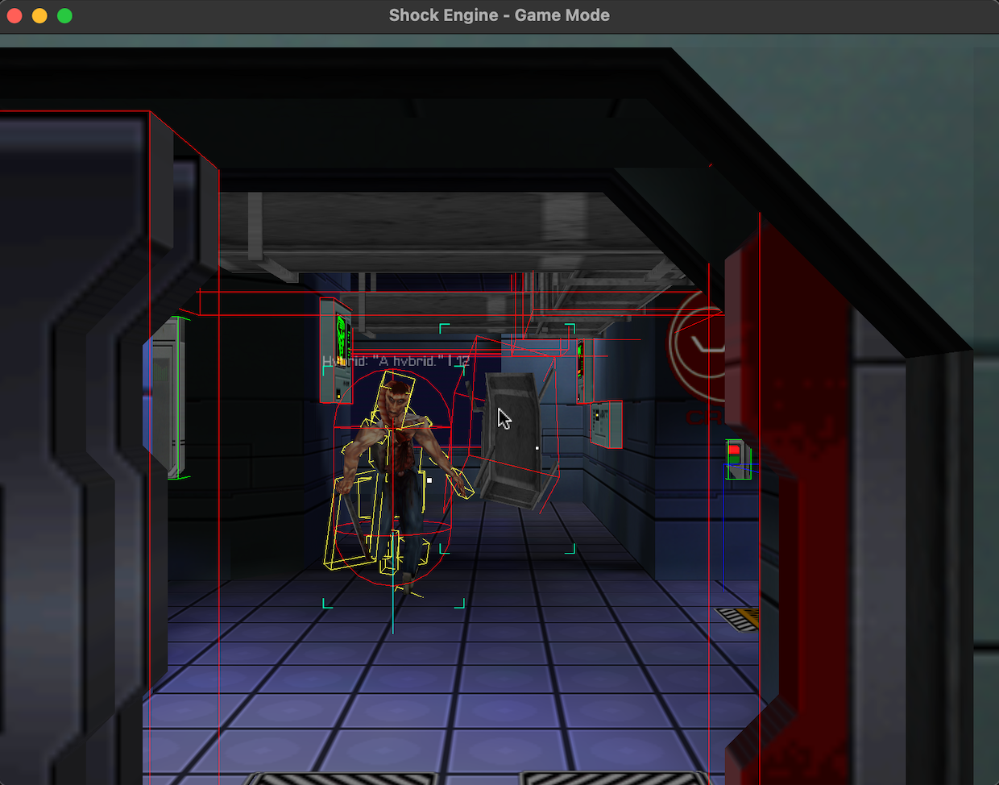
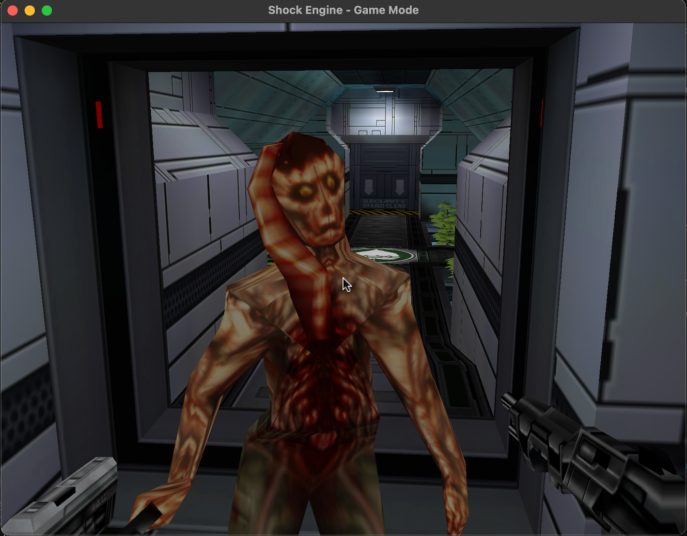
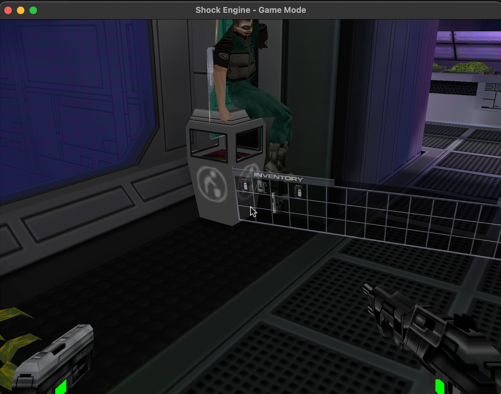

# shock2quest

[](https://github.com/tommy-xr/shock2quest/actions/workflows/build.yml) [](https://github.com/tommy-xr/shock2quest/actions/workflows/build-android.yml)

A project to experience System Shock 2 in virtual reality. System Shock 2 is one of my favorite games of all time, and the story and ambience would be great for VR. 

This project is a [game engine recreation](https://en.wikipedia.org/wiki/Game_engine_recreation) of the [Dark engine](https://en.wikipedia.org/wiki/Dark_Engine) - geared towards VR experiences.

You'll need a full retail copy of **System Shock 2: 25th Anniversary Remaster** in order to play - purchase at either [GoG](https://www.gog.com/en/game/system_shockr_2_25th_anniversary_remaster) or [Steam](https://store.steampowered.com/app/866570/). Its upgraded models and textures are what the VR hands and weapons are built against.

Once installed, copy `sshock2.kpf` and the `mods/` folder from it - see [DEVELOPMENT.md](DEVELOPMENT.md) for desktop and Quest setup.

>NOTE: This is currently in a _pre-alpha_ state and not really playable in any meaningful way, yet. I also have to apologize for the quality of the code, this is my first Rust project - so certainly a lot of room for improvement (and a lot of hacks and experiments!) It's a project done in bits of spare time, but wanted to share out in case it is fun or useful for anyone.

## Screenshots

- Hitboxes



- Dual Wielding + Character Models



- Floating Inventory for VR



## Running

> TODO: Provide binaries

### Controls

This is geared towards VR, so the control scheme is really meant for VR headsets and controllers.

However, you can play with a keyboard and a mouse, using the following hard-coded keys:
- `Mouse` - look around with headset, when `Q` and `E` are not pressed
- `W` `A` `S` `D` - move around (hold `Shift` to move faster)
- `Q` `E` - control left hand or right hand, respectively. Mouse look will move the hand, left click will 'trigger', and right click will 'grab'.
- `Ctrl` - crouch
- `Space` - jump
- `Tab` / `I` - toggle the cyber interface ("use" mode): a cursor-driven UI over the 3D view
- `Alt+S` / `Alt+L` - quick save / quick load
- Quest VR: press the left controller's `Menu` button to toggle the cyber
  interface; hold it for half a second - a ring fills in front of you - to open
  the pause menu instead. The interface also carries a `MENU` button that opens
  it directly.
- Quest VR: either lower face button (left `X` / right `A`) jumps, whatever
  your hands are holding.
- Quest VR: squeeze an empty hand near a ladder to hold it. A cyan marker
  above the fist confirms the hold. To descend from a deck, crouch and grab
  near the ladder's top edge, pull the held hand toward your chest to move
  your body beyond the edge, then raise that hand to lower yourself. Open
  the hand to release. When transferring onto a deck, keep its hand squeezed
  while releasing the ladder. You can grip the deck with the second hand too,
  then pull down or inward slowly with the newly placed hand to climb onto it.
  Releasing that hand transfers support to the other held hand. No flick
  or release is needed to finish the pull. If the deck blocks your
  pull, the held hand keeps supporting you until you open it; relax or adjust
  the pull to continue.
- Quest VR: grip nanites, cyber modules, software upgrades or found access cards
  to hold them; release anywhere to download them, with sound and haptic feedback.
  Draw your personal access card from the belt buckle to scan credential
  readers and machines. Release it to return it to the belt. Scanning a shop or
  trainer opens its interface; purchases still require an explicit selection.
- Quest VR: reload by hand. Pull a clip out of the cyber interface's inventory
  strip with your free hand and bring it to the gun the other hand is holding -
  the clip goes in and the weapon is loaded. A clip of a different ammo type
  swaps the type over, returning the rounds already loaded to your pack.
  While holding a clip, tap that hand's upper button (`Y` / `B`) to exchange it
  for the next compatible ammo type in your backpack; the original clip returns
  to the pack with its rounds intact. Insert the new clip to load that type.
- Quest VR: rearrange inventory by gripping an item, pointing at its new
  location, and releasing. Tall items slide up to fit the chosen column.
  The ghost footprint previews the destination: green for placement or merging,
  amber for automatic placement elsewhere, and red when the pack has no room
  and releasing will drop the item into the world.
- Quest VR: with that hand free, press an upper face button (left `Y` / right
  `B`) to open the newest unread audio log. Press it again to close it; after
  every log is read, it replays the most recently collected log. Holding a
  weapon, that hand's upper button is the weapon's instead: tap and release to
  switch a gun's fire mode, or hold for half a second to drop its loaded clip
  into the world. A thin line fills left to right along the bottom of the cuff
  ammo meter, which shows `EJECT` during the hold. A completed hold does not
  also switch modes. The psi amp keeps
  its power selector.
- Directly equip a matching carried weapon with the original number-row bindings:
  `1` Wrench, `2` Pistol, `3` Shotgun, `4` Assault Rifle, `5` Laser Pistol,
  `6` EMP Rifle, `7` Electro Shock, `8` Grenade Launcher, `9` Stasis Field
  Generator, `0` Fusion Cannon, `-` Crystal Shard, `=` Viral Proliferator,
  `\` Worm Launcher, and `` ` `` / `~` Psi Amp

Development builds carry additional debug keys and a Developer options screen -
see [DEVELOPMENT.md](DEVELOPMENT.md#debug--developer-keys).

## Building

See [DEVELOPMENT.md](DEVELOPMENT.md)

### Quick Start with Cargo Aliases

The project includes convenient cargo aliases:
- `cargo dr` - Run desktop runtime (shorthand for `cargo run -p desktop_runtime --`)
- `cargo dq` - Run dark_query CLI tool (shorthand for `cargo run -p dark_query --`)
- `cargo dv` - Run dark_viewer tool (shorthand for `cargo run -p dark_viewer --`)
- `cargo dbgr` - Run the HTTP-controlled debug runtime (used for automation/testing; see `tools/shock2-sdk` for the TypeScript SDK that drives it)

Example usage:
```bash
cargo dr --experimental teleport  # Run desktop with teleport feature
cargo dq entities earth.mis --limit 5  # Query entities in mission
cargo dv grunt_p.bin  # View model file
```

## Roadmap

 Pre Alpha: Initial development 
- [x] Load gamesys 
- [x] Speech DB / env sounds 
- [ ] Menu / Launcher
- [ ] Character sounds
- [ ] Basic AI 
- [ ] Load/save 
- [ ] Basic item usage 
- [ ] Initial inventory management 
- [ ] Psi Powers
- [ ] Act/React implementation 
- [ ] Cutscenes
- [ ] Lighting implementation (Doom 3 multi-pass shadow rendering)
- [ ] Mod support

## License

Some code is ported from [openDarkEngine](https://github.com/volca02/openDarkEngine), so this code is licensed under [GPLv2](https://www.gnu.org/licenses/old-licenses/gpl-2.0.en.html) to comply with that license.

In addition, code in the `engine` folder is agnostic of Shock2, so is dual-licensed under the MIT license.

# Credits

- Demo assets are from [BabylonJS Assets](https://github.com/BabylonJS/Assets).
- VR glove model adapted from Valve's [SteamVR Unity Plugin](https://github.com/ValveSoftware/steamvr_unity_plugin).

# Thanks

There were several projects around the SS2 community, that served as an inspiration, or were used to help understand the internals of the dark engine and file formats, notably:

- [openDarkEngine](https://github.com/volca02/openDarkEngine) by [volca02](https://github.com/volca02)
- [SystemShock2VR](https://github.com/Kernvirus/SystemShock2VR) by [Kernvirus](https://github.com/Kernvirus)

Outside of the system shock/thief community, the work that [Team Beef](https://sidequestvr.com/community/7/team-beef-game-ports) has done in bringing games to VR inspired this project. 

In addition, there were several great Rust libraries that helped bring this project to life:
- [`rapier`](https://github.com/dimforge/rapier) - Physics Library
- [`openxr`](https://github.com/Ralith/openxrs) - Bindings for OpenXR
- [`rodio`](https://github.com/RustAudio/rodio) - Audio Support
- [`serde`](https://serde.rs/) - Serialization / Deserialization (Load/Save)
- [`cgmath`](https://github.com/rustgd/cgmath) - Vector math library
- [`clap`](https://docs.rs/clap/latest/clap/) - Command line parsing
- [`cargo-apk`](https://github.com/rust-mobile/cargo-apk) - easy cross-compiling to android

Finally, thank you to [Nightdive Studios](https://www.nightdivestudios.com/) for keeping these retro games alive, as well as Le Corbeau for the NewDark patches that allowed me to revisit the SS2 universe
