# shock2quest

[](https://github.com/tommy-xr/shock2quest/actions/workflows/build.yml) [](https://github.com/tommy-xr/shock2quest/actions/workflows/build-android.yml)
[](https://github.com/tommy-xr/shock2quest/releases/latest)

A project to experience System Shock 2 in virtual reality. System Shock 2 is one of my favorite games of all time, and the story and ambience would be great for VR. 

This project is a [game engine recreation](https://en.wikipedia.org/wiki/Game_engine_recreation) of the [Dark engine](https://en.wikipedia.org/wiki/Dark_Engine) - geared towards VR experiences.

You'll need a full retail copy of **System Shock 2: 25th Anniversary Remaster** in order to play - purchase at either [GoG](https://www.gog.com/en/game/system_shockr_2_25th_anniversary_remaster) or [Steam](https://store.steampowered.com/app/866570/). Its upgraded models and textures are what the VR hands and weapons are built against.

Once installed, copy `sshock2.kpf` and the `mods/` folder from it - see [DEVELOPMENT.md](DEVELOPMENT.md) for desktop and Quest setup.

>NOTE: This is currently in a _pre-alpha_ state and not really playable in any meaningful way, yet. I also have to apologize for the quality of the code, this is my first Rust project - so certainly a lot of room for improvement (and a lot of hacks and experiments!) It's a project done in bits of spare time, but wanted to share out in case it is fun or useful for anyone.

## Screenshots


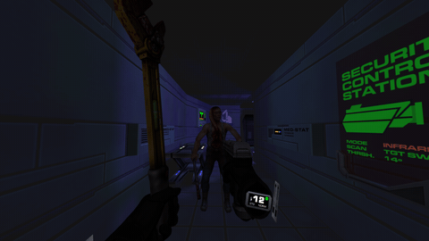 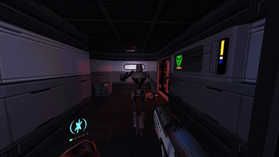
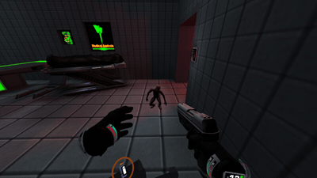 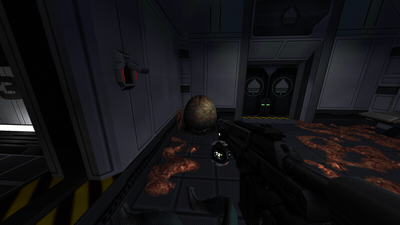

## Running

Download the signed Quest APK from the [latest release](https://github.com/tommy-xr/shock2quest/releases/latest),
then follow the [installation instructions](INSTALL.md) to sideload it and copy
your remaster game files.

### Controls

#### Desktop / Flat
This is geared towards VR, so the control scheme is really meant for VR headsets and controllers, but you can run in flat mode for testing:

However, you can play with a keyboard and a mouse, using the following hard-coded keys:
- `Mouse` - look around (flat); in `--vr`, aim the head unless `Q` or `E` is held
- `W` `A` `S` `D` - move around (hold `Shift` to move faster)
- `Q` / `E` - hold to lean left/right in flat mode; release to return. Both keys cancel. Leaning works while crouched and stops against solid geometry. In `--vr`, these keys still control the simulated left/right hand: mouse aims, left click triggers, and right click grabs.
- `B` (or `T`) - cycle ammunition type in flatscreen, then automatically reload from matching reserve
- `R` - reload the current ammunition type
- `Ctrl` - crouch
- `Space` - jump
- `Tab` - toggle the cyber interface ("use" mode): a cursor-driven UI over the 3D view
- `Alt+S` / `Alt+L` - quick save / quick load

- Equip a carried weapon with the number row: `1` Wrench, `2` Pistol,
  `3` Shotgun, `4` Assault Rifle, `5` Laser Pistol, `6` EMP Rifle,
  `7` Electro Shock, `8` Grenade Launcher, `9` Stasis Field Generator,
  `0` Fusion Cannon, `-` Crystal Shard, `=` Viral Proliferator,
  `\` Worm Launcher, and `` ` `` / `~` Psi Amp

#### Quest VR

| Control | Action |
| --- | --- |
| Right stick | Move |
| Left stick left/right | Turn |
| Crouch physically, or click the left stick | Crouch; click again to stand |
| Lower face button: left **X** / right **A** | Jump, even with both hands full; close the cyber interface when it is open |
| Left **Menu** | Tap to toggle the cyber interface; hold 0.5 seconds to pause |
| Grip | Pick up and hold an item; release to drop or throw it |
| Trigger | Use the held item, fire a gun, or cast with the psi amp; point and trigger to interact |

The **upper face button** (left **Y** / right **B**) acts on what that hand holds:

| Held item | Tap | Hold 0.5 seconds |
| --- | --- | --- |
| Gun | Switch fire mode | Eject the loaded clip |
| Psi amp | Swap current and alternate powers | Open the power selector |
| Ammo clip | Swap to the next compatible ammo type in your backpack | — |
| Empty hand or other item | Open/close the newest unread audio log; replay the latest once all are read | — |

**Weapons and powers.** Reload by taking a clip from the cyber interface's
inventory strip and bringing it to the gun. Inserting another ammo type returns
the loaded rounds to your backpack. In the amp's power selector, use that hand's
stick up/down for tiers and left/right for purchased powers; confirm with its
upper button or trigger. Each amp remembers its current and alternate powers.

**Inventory and equipment.** Grip an inventory item, point at its destination,
and release. The preview is green when it fits or merges, amber for automatic
placement elsewhere, and red when releasing will drop it into the world.
Pass an item between hands by squeezing the receiving hand nearby, then releasing
the carrying hand. Stow a compact gun, melee weapon, or amp at either thigh by
releasing it there; squeeze again to retrieve it.

**Access and pickups.** Grip nanites, cyber modules, software upgrades, or found
access cards, then release anywhere to download them. Draw your personal access
card from the belt buckle to scan readers, shops, and trainers; release to return
it to the belt. Scanning opens an interface; select purchases separately.

**Climbing.** Squeeze an empty hand near a ladder or ledge to grab it, then move
that hand to pull yourself along. A cyan marker confirms the hold. To climb onto
a deck, keep one hand attached while placing the other on the edge, then pull
down or inward. To descend, crouch, grip near the ladder's top, pull yourself past
the edge, and raise the held hand to lower your body. Release grip to let go.

**Implants.** Bring a held implant to the narrow socket on the pinky side of the opposite wristband and
release grip to install it. Squeeze with the empty opposite hand to remove it.
Either wrist can hold your first implant; the other locks while it is occupied.
Cybernetically Enhanced allows both wrists at once. The implant seats inside
the raised rim, with a separate bar below the housing showing its remaining charge. Installed implants keep their backpack slot and need power to
supply their bonuses. Recharge them at a recharge station.

Development builds carry additional debug keys and a Developer options screen -
see [DEVELOPMENT.md](DEVELOPMENT.md#debug--developer-keys).

## Building

See [DEVELOPMENT.md](DEVELOPMENT.md)

### Quick Start with Cargo Aliases

The project includes convenient cargo aliases:
- `cargo dr` - Run desktop runtime (shorthand for `cargo run -p desktop_runtime --`)
- `cargo dvr` - Open the Quest device dashboard ([commands](tools/dark_vr_tool/README.md))
- `cargo dx` - Open the asset explorer, including model previews, archetypes, audio, and VR pose editing (`cargo dx ui`)
- `cargo bn` - Run pathfinding benchmarks and inspect navigation data
- `cargo dq` - Run dark_query CLI tool (shorthand for `cargo run -p dark_query --`)
- `cargo dv` - Run dark_viewer tool (shorthand for `cargo run -p dark_viewer --`)
- `cargo dbgr` - Run the HTTP-controlled debug runtime (used for automation/testing; see `tools/shock2-sdk` for the TypeScript SDK that drives it)

Example usage:
```bash
cargo dr --vr --experimental physical_held_items  # Run desktop with physical held items
cargo dx ui --archetype Rumbler  # Browse an archetype and its model
cargo dq entities earth.mis --limit 5  # Query entities in mission
cargo dv grunt_p.bin  # View model file
```

### Development tools

| Tool | Purpose | Example |
| --- | --- | --- |
| `cargo dx` | Browse assets and archetypes; preview models, animations, and audio; author VR grips and belt-card poses | `cargo dx ui --archetype Rumbler` |
| `cargo dv` | Inspect a model, its skeleton, hitboxes, or articulated parts | `cargo dv grunt_p.bin --debug-skeletons` |
| `cargo dvr` | Inspect an attached Quest, deploy builds, and collect device diagnostics | `cargo dvr` |
| `cargo dq` | Query mission entities, template inheritance, motions, and speech | `cargo dq entities earth.mis --limit 5` |
| `cargo bn` | Inspect and benchmark navigation data | `cargo bn path stats medsci1.mis` |
| `cargo dbgr` | Drive the game over HTTP for deterministic testing and captures | `cargo dbgr --mission medsci1.mis` |
| `asset_probe` | Check which extracted models, textures, and motions the parsers can load | `cargo run -p asset_probe -- <asset-directory>` |
| `hitbox_analyzer` | Inspect creature limb collision fit and bone coverage | `cargo run -p hitbox_analyzer -- <mesh.bin>` |

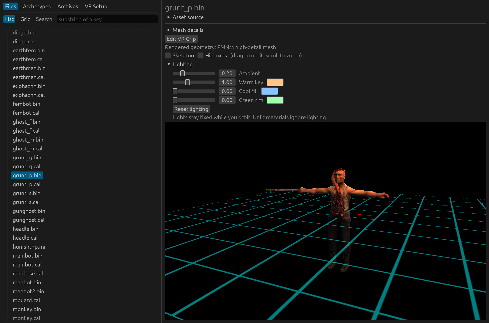 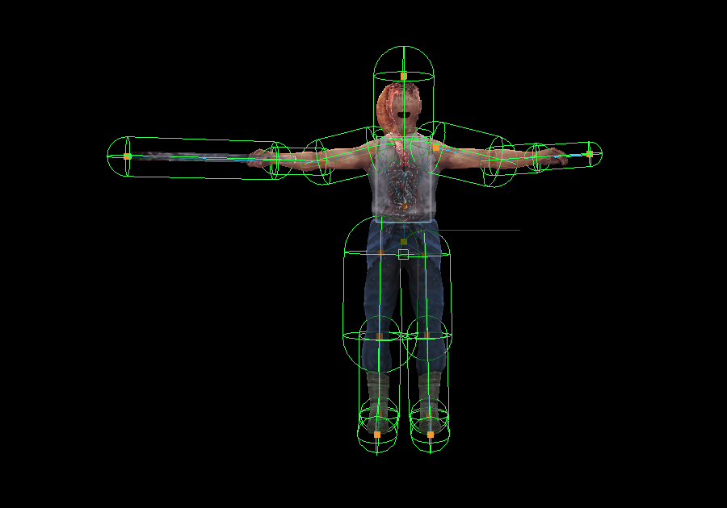
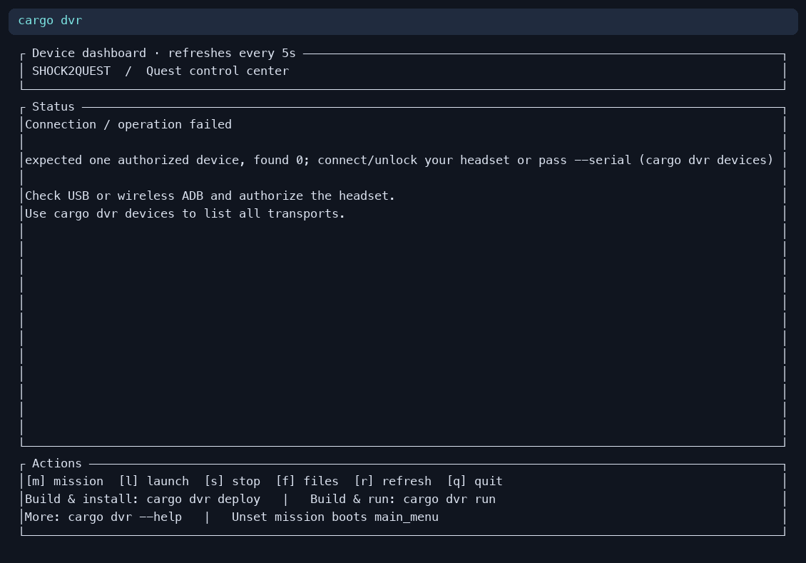 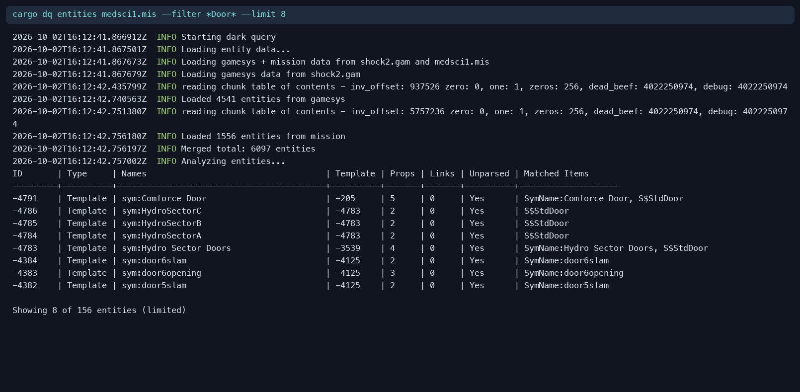
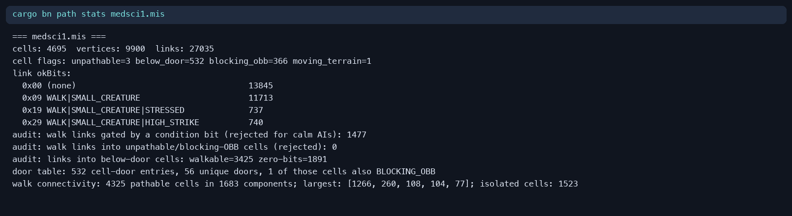 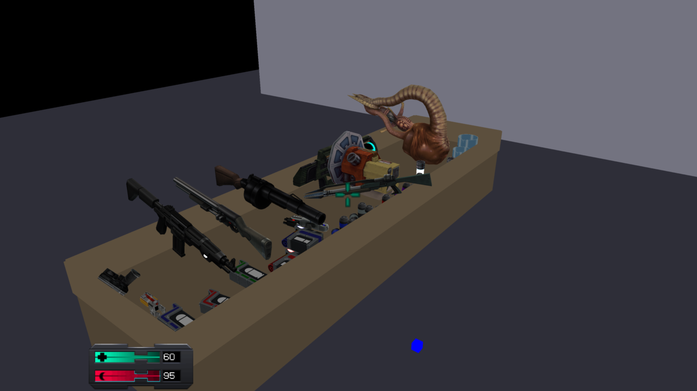
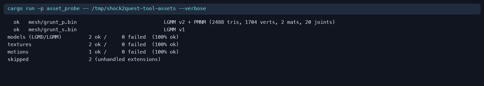 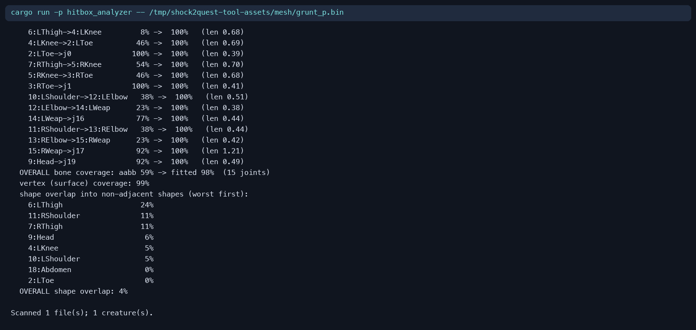

`cargo dbgc` is currently a placeholder. Use the [TypeScript SDK](tools/shock2-sdk)
or HTTP requests to control the debug runtime.

## Roadmap

 Pre Alpha: Initial development 
- [x] Load gamesys 
- [x] Speech DB / env sounds 
- [x] Menu / Launcher
- [x] Character sounds
- [x] Basic AI 
- [x] Load/save 
- [x] Basic item usage 
- [x] Initial inventory management 
- [x] Psi Powers
- [x] Act/React implementation 
- [x] Cutscenes
- [ ] Lighting implementation (Doom 3 multi-pass shadow rendering)
- [ ] Mod support

## License

Some code is ported from [openDarkEngine](https://github.com/volca02/openDarkEngine), so this code is licensed under [GPLv2](https://www.gnu.org/licenses/old-licenses/gpl-2.0.en.html) to comply with that license.

In addition, code in the `engine` folder is agnostic of Shock2, so is dual-licensed under the MIT license.

# Credits

- Demo assets are from [BabylonJS Assets](https://github.com/BabylonJS/Assets).
- VR glove model adapted from Valve's [SteamVR Unity Plugin](https://github.com/ValveSoftware/steamvr_unity_plugin).

# Thanks

There were several projects around the SS2 community, that served as an inspiration, or were used to help understand the internals of the dark engine and file formats, notably:

- [openDarkEngine](https://github.com/volca02/openDarkEngine) by [volca02](https://github.com/volca02)
- [SystemShock2VR](https://github.com/Kernvirus/SystemShock2VR) by [Kernvirus](https://github.com/Kernvirus)

Outside of the system shock/thief community, the work that [Team Beef](https://sidequestvr.com/community/7/team-beef-game-ports) has done in bringing games to VR inspired this project. 

In addition, there were several great Rust libraries that helped bring this project to life:
- [`rapier`](https://github.com/dimforge/rapier) - Physics Library
- [`openxr`](https://github.com/Ralith/openxrs) - Bindings for OpenXR
- [`rodio`](https://github.com/RustAudio/rodio) - Audio Support
- [`serde`](https://serde.rs/) - Serialization / Deserialization (Load/Save)
- [`cgmath`](https://github.com/rustgd/cgmath) - Vector math library
- [`clap`](https://docs.rs/clap/latest/clap/) - Command line parsing
- [`cargo-apk`](https://github.com/rust-mobile/cargo-apk) - easy cross-compiling to android

Finally, thank you to [Nightdive Studios](https://www.nightdivestudios.com/) for keeping these retro games alive, as well as Le Corbeau for the NewDark patches that allowed me to revisit the SS2 universe
